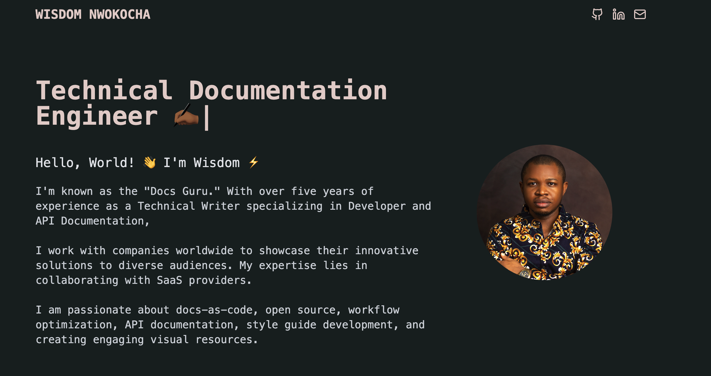

# Welcome to My Portfolio Project!



Hello there! 👋

Thank you for checking out my portfolio project. This repository contains all the necessary files to set up my portfolio locally on your machine. Follow the instructions below to get started.

## Technologies Used

This project uses the following technologies:

- [React](https://reactjs.org/)
- [Vite](https://vitejs.dev/)
- [Tailwind CSS](https://tailwindcss.com/)

## Getting Started

To set up the portfolio locally, you'll need to have the following installed on your machine:

- [Git](https://git-scm.com/)
- [Node.js](https://nodejs.org/)

### Clone the Repository

First, clone the repository to your local machine using the following command:

```bash
git clone https://github.com/Aahil13/Portfolio.git
```

### Install Dependencies

Navigate to the project directory and install the required dependencies:

```bash
cd Portfolio
npm install
```

### Run the Project

Once the dependencies are installed, you can run the project locally with:

```bash
npm run dev
```

Your portfolio should now be running on `http://localhost:5173`. Open this URL in your browser to see it in action!